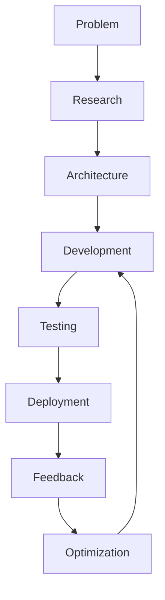
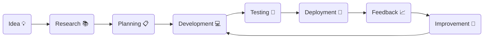

<div align="center">


<br>


<br><br>


</div>

---

#  Hello World!

```cpp
#include<iostream>
using namespace std;

class Developer
{
public:

    string name = "Gulshan Kumar";

    string role = "B.Tech Information Technology Student";

    string location = "India 🇮🇳";

    string passion = "Artificial Intelligence & Software Engineering";

    string currentMission =
        "Learning DSA • Building AI Projects • Open Source";

    void sayHi()
    {
        cout<<"Welcome to my GitHub Profile!";
    }
};

int main()
{
    Developer me;

    me.sayHi();

    return 0;
}
```

---

# 🌌 ABOUT ME


### 👨‍💻 Who Am I?

🚀 B.Tech Information Technology Student

🤖 Passionate about Artificial Intelligence & Machine Learning

💻 Full Stack Development Enthusiast

📚 Currently mastering Data Structures & Algorithms

🌱 Learning every single day

⚡ Building impactful software projects

🎯 Goal: Become a world-class Software Engineer

---

### 🧠 Current Focus

✔ AI & Machine Learning

✔ Full Stack Development

✔ DSA

✔ Open Source

✔ System Design

✔ Backend Engineering

✔ Cloud Technologies

---

### 💡 Philosophy

> **"Dream Big. Start Small. Build Daily."**

---

# ⚡ QUICK FACTS

<table>

<tr>

<td width="50%">

🏫 B.Tech IT Student

🤖 AI/ML Explorer

💻 Future Software Engineer

🚀 Open Source Learner

📚 DSA Enthusiast

</td>

<td width="50%">

🔥 Loves solving problems

🌍 Always learning

⚙ Building scalable projects

🧠 Curious about new technologies

☕ Coffee + Code = Productivity

</td>

</tr>

</table>
# ⚔️ TECH ARSENAL

<div align="center">

## 💻 Programming Languages


<br><br>

## 🌐 Web Development


<br><br>

## 🤖 Artificial Intelligence & Machine Learning


<br>


<br><br>

## 🗄️ Databases


<br><br>

## ☁️ Cloud & DevOps


<br><br>

## 🛠 Development Tools


</div>

---

# 🚀 ENGINEERING STACK

<table>

<tr>

<td align="center">

### 🧠 AI / ML

TensorFlow

PyTorch

Scikit-Learn

OpenCV

NumPy

Pandas

</td>

<td align="center">

### 🌐 Backend

Node.js

Express.js

REST APIs

JWT Authentication

Prisma ORM

</td>

<td align="center">

### 🎨 Frontend

React

Next.js

Tailwind CSS

HTML5

CSS3

JavaScript

</td>

</tr>

</table>

---

# 📚 CURRENT LEARNING ROADMAP

<div align="center">

| Technology | Progress |
|------------|----------|
| C++ | 🟩🟩🟩🟩🟩🟩🟩🟩⬜⬜ 80% |
| Python | 🟩🟩🟩🟩🟩🟩🟩🟩🟩⬜ 90% |
| Data Structures | 🟩🟩🟩🟩🟩🟩🟩⬜⬜⬜ 70% |
| Algorithms | 🟩🟩🟩🟩🟩🟩⬜⬜⬜⬜ 60% |
| Machine Learning | 🟩🟩🟩🟩🟩🟩🟩⬜⬜⬜ 70% |
| Deep Learning | 🟩🟩🟩🟩🟩⬜⬜⬜⬜⬜ 50% |
| Backend Development | 🟩🟩🟩🟩🟩🟩🟩⬜⬜⬜ 70% |
| System Design | 🟩🟩🟩⬜⬜⬜⬜⬜⬜⬜ 30% |

</div>

---

# 🧠 MY DEVELOPMENT PHILOSOPHY

```text
          IDEA 💡
             │
             ▼
      RESEARCH 📖
             │
             ▼
      ARCHITECTURE 🏗️
             │
             ▼
       DEVELOPMENT 💻
             │
             ▼
         TESTING 🧪
             │
             ▼
        DEPLOYMENT 🚀
             │
             ▼
        ITERATION 🔄
```

---

# ⚡ CURRENT MISSION

```cpp
while(true)
{
    Learn();

    PracticeDSA();

    BuildProjects();

    ReadDocumentation();

    PushToGitHub();

    Repeat();
}
```

---

# 🌟 AREAS OF INTEREST

<div align="center">

| 🤖 AI | 💻 Software | 🚀 Future |
|-------|------------|-----------|
| Machine Learning | Full Stack Development | Artificial Intelligence |
| Deep Learning | Backend Engineering | Cloud Computing |
| Computer Vision | System Design | Open Source |
| NLP | REST APIs | Scalable Systems |
| Data Science | Microservices | Modern Web Apps |

</div>

---

# 🏅 CORE VALUES

<div align="center">

🚀 Build Real Projects

⚡ Learn Every Day

🧠 Think Like an Engineer

🤝 Contribute to Open Source

📚 Never Stop Learning

🌍 Create Technology That Matters

</div>
# 📊 GITHUB ANALYTICS DASHBOARD

<div align="center">


</div>

<br>

<div align="center">


</div>

---

# 📈 CONTRIBUTION GRAPH

<div align="center">


</div>

---

# 🐍 CONTRIBUTION SNAKE

<div align="center">


</div>

---

# 🏆 GITHUB TROPHIES

<div align="center">


</div>

---

# 📈 DEVELOPMENT SUMMARY

<div align="center">

| 🚀 Profile | 📊 Status |
|------------|-----------|
| Public Repositories | Growing Every Week 🚀 |
| Open Source | Active Contributor |
| Primary Language | C++ / Python |
| Interests | AI • ML • Backend • DSA |
| Current Goal | Software Engineering |
| Learning | Every Day |

</div>

---

# ⚡ GITHUB JOURNEY

```text
Create Repository
        │
        ▼
Write Code
        │
        ▼
Commit Changes
        │
        ▼
Push to GitHub
        │
        ▼
Review & Improve
        │
        ▼
Deploy Project
        │
        ▼
Share With Community
        │
        ▼
Repeat Forever ♾️
```

---

# 💻 CODING STATS

<div align="center">


</div>

> **Note:** If this card ever shows an API rate-limit error again, simply remove this section. It uses the same service that occasionally hits GitHub API limits.

---

# 📅 COMMIT PHILOSOPHY

```cpp
while(success != true)
{
    Learn();

    Code();

    Commit();

    Push();

    Improve();

    Repeat();
}
```

---

# 🌟 DEVELOPER MINDSET

<div align="center">

| 💡 Think | ⚡ Build | 🚀 Improve |
|----------|----------|------------|
| Solve Problems | Write Clean Code | Keep Learning |
| Read Documentation | Build Projects | Ship Products |
| Learn Algorithms | Practice Daily | Never Give Up |

</div>

---

# 🎯 2026 GOALS

<div align="center">

🟢 Master Data Structures & Algorithms

🟢 Become an Advanced Full Stack Developer

🟢 Build Production-Ready AI Applications

🟢 Contribute to Open Source

🟢 Secure a Top Software Engineering Internship

🟢 Crack Product-Based Company Interviews

🟢 Solve 500+ DSA Problems

🟢 Publish Multiple AI Projects

</div>
---
# 🚀 FEATURED PROJECTS

<div align="center">

> *"Building real-world software that solves meaningful problems."*

</div>

---

# 🚆 RAIL YATRA PLATFORM

<div align="center">

### 🤖 AI-Powered Smart Railway Assistant


</div>

### 🚀 Overview

An AI-powered railway platform that enhances the travel experience using intelligent prediction, automation, and smart recommendations.

### ⭐ Features

✅ AI Ticket Confirmation Prediction

✅ Smart Alternative Train Suggestions

✅ PNR Analysis

✅ Voice AI Assistant

✅ Personalized Travel Recommendations

✅ Subscription System

✅ Modern Dashboard

✅ Secure Authentication

---

### ⚙ Tech Stack

```text
Next.js
NestJS
FastAPI
Prisma
JWT
Docker
PostgreSQL
OpenAI APIs
```

---

<div align="center">

🔗 **GitHub:** *(Add Repository Link Here)*

🌐 **Live Demo:** *(Coming Soon)*

</div>

---

# 🏥 HOSPITAL MANAGEMENT SYSTEM

<div align="center">

### Modern Healthcare Management Platform


</div>

### 🚀 Features

✅ Secure Login System

✅ JWT Authentication

✅ Refresh Tokens

✅ Role Based Access

✅ Patient Management

✅ Doctor Dashboard

✅ Appointment Scheduling

✅ Email Verification

✅ Password Reset

✅ Production Deployment

---

### ⚙ Tech Stack

```text
React

Node.js

Express

MongoDB

Docker

JWT

Vercel

Railway
```

---

<div align="center">

🔗 **GitHub:** *(Add Repository Link)*

🌐 **Live Website:** *(Add URL)*

</div>

---

# 🤖 VERILEX AI

<div align="center">

### AI Powered Document Verification System


</div>

### Features

✅ Fake Document Detection

✅ OCR Processing

✅ Deep Learning Models

✅ Image Classification

✅ AI Verification

✅ Automated Validation

---

### Tech Stack

```text
Python

TensorFlow

OpenCV

NumPy

Pandas

Machine Learning
```

---

<div align="center">

🔗 **GitHub:** *(Add Repository)*

</div>

---

# 🌐 PORTFOLIO WEBSITE

<div align="center">

### Personal Developer Portfolio


</div>

### Features

✨ Modern UI

✨ Responsive Design

✨ Dark Mode

✨ Project Showcase

✨ Resume

✨ Contact Form

---

<div align="center">

🌍 Website

https://gulshanverse.vercel.app

</div>

---

# 🤖 AI / MACHINE LEARNING PROJECTS

### Projects

🧠 Machine Learning Models

📊 Data Analysis

📈 Predictive Analytics

🤖 Deep Learning

👁 Computer Vision

📚 NLP Experiments

⚡ Recommendation Systems

---

# 🏆 PROJECT TIMELINE

```text
2025

│

├── Portfolio Website

│

├── Machine Learning Projects

│

├── Hospital Management System

│

├── Verilex AI

│

└── Rail Yatra Platform

↓

Future

↓

AI Startup 🚀
```

---

# 📌 PINNED REPOSITORIES

<div align="center">

| Repository | Description |
|------------|-------------|
| 🚆 Rail Yatra | AI Railway Assistant |
| 🏥 Hospital Management System | Full Stack Healthcare Platform |
| 🤖 Verilex AI | AI Document Verification |
| 🌐 Portfolio | Personal Portfolio |
| 📊 Machine Learning | ML Experiments |
| 💻 DSA | Problem Solving Journey |

</div>

---

# 💡 CURRENTLY BUILDING

```cpp
class CurrentFocus
{
public:

    vector<string> projects =
    {
        "Rail Yatra Platform",

        "Artificial Intelligence",

        "Machine Learning",

        "Open Source",

        "Data Structures",

        "Backend Development"
    };
};
```

---

# 🚀 WHAT'S NEXT?

✅ Advanced AI Projects

✅ Cloud Computing

✅ System Design

✅ Kubernetes

✅ Competitive Programming

✅ Open Source Contributions

✅ Product-Based Company Preparation

---
# 🏆 ACHIEVEMENTS & MILESTONES

<div align="center">


</div>

---

# 🎯 JOURNEY SO FAR

```text
2023
│
├── Started B.Tech IT
│
├── Started Programming
│
└── Learned C & Python
│
▼
2024
│
├── Data Structures & Algorithms
├── AI & Machine Learning
├── Git & GitHub
└── Open Source
│
▼
2025
│
├── Hospital Management System
├── Portfolio Website
├── Verilex AI
├── Rail Yatra Platform
└── Advanced Backend Development
│
▼
2026
│
🎯 Product-Based Company
🎯 Open Source Contributions
🎯 AI Engineer
```

---

# 💼 EXPERIENCE

<table>

<tr>

<td width="50%">

## 👨‍💻 AI & ML Developer

- Machine Learning
- Deep Learning
- Computer Vision
- Data Analysis
- AI Applications

</td>

<td width="50%">

## 💻 Full Stack Developer

- React
- Next.js
- Node.js
- Express
- REST APIs
- Authentication

</td>

</tr>

</table>

---

# 📜 CERTIFICATIONS

> 🚧 Currently expanding my certifications through continuous learning.

- 📚 Machine Learning
- 📚 Artificial Intelligence
- 📚 Full Stack Development
- 📚 Cloud Computing
- 📚 Data Structures & Algorithms

---

# 🏅 HACKATHONS

<div align="center">

🥇 NHIDE Hackathon *(Update with final achievement if applicable)*

🚀 AI Innovation Projects

💡 Full Stack Development Challenges

</div>

---

# 🌱 CURRENTLY LEARNING

```text
██████████░░░░░░░░░░  C++

█████████░░░░░░░░░░░  Python

████████░░░░░░░░░░░░  Data Structures

███████░░░░░░░░░░░░░  Algorithms

███████░░░░░░░░░░░░░  Machine Learning

██████░░░░░░░░░░░░░░  Deep Learning

███████░░░░░░░░░░░░░  Backend Development

████░░░░░░░░░░░░░░░░  System Design
```

---

# 🎯 2026 ROADMAP

<div align="center">

| Goal | Status |
|------|--------|
| 🚀 Build 10+ Production Projects | 🔄 In Progress |
| 💻 Solve 500+ DSA Problems | 🔄 In Progress |
| 🤖 Master AI & ML | 🔄 In Progress |
| 🌍 Contribute to Open Source | 🔄 In Progress |
| ☁ Learn Cloud Computing | 📅 Planned |
| 🏗 Learn System Design | 📅 Planned |
| 💼 Crack Product-Based Companies | 🎯 Target |

</div>

---

# 📈 GITHUB GOALS

```cpp
class Goals
{
public:

    int repositories = 50;

    int projects = 20;

    int contributions = 5000;

    int dsaProblems = 500;

    string targetCompany = "Microsoft | Google | Amazon";
};
```

---

# 🤝 LET'S CONNECT

<div align="center">

<a href="https://github.com/gulshanverse">

</a>

<a href="https://linkedin.com/in/gulshanverse">

</a>

<a href="https://gulshanverse.vercel.app">

</a>

<a href="mailto:gulshankumaritggv@gmail.com">

</a>

<a href="https://leetcode.com/gulshanverse_lc">

</a>

<a href="https://www.hackerrank.com/gulshanverse">

</a>

</div>

---

# 💬 FAVORITE QUOTE

<div align="center">

> **"Success is built one commit at a time."**

</div>

---

# ⚡ DEVELOPER MANIFESTO

```cpp
while(life)
{
    Learn();

    Build();

    Fail();

    Improve();

    Share();

    Repeat();
}
```

---

<div align="center">

### ⭐ Thanks for visiting my profile!

*"Building technology that creates impact."*

</div>

---
# 🌍 CODING PROFILES

<div align="center">

<a href="https://leetcode.com/gulshanverse_lc">

</a>

</div>

<br>

<div align="center">

<a href="https://www.hackerrank.com/gulshanverse">


</a>

<a href="https://github.com/gulshanverse">


</a>

<a href="https://linkedin.com/in/gulshanverse">


</a>

</div>

---

# 📊 DEVELOPER DASHBOARD

<div align="center">

| 🚀 Focus | 📈 Status |
|----------|-----------|
| AI & ML | 🔥 Active |
| Full Stack | 🔥 Active |
| DSA | 🚀 Daily Practice |
| Backend | 🚀 Learning |
| Open Source | 🌱 Growing |
| System Design | 📚 Learning |

</div>

---

# 🎖 ACHIEVEMENT BADGES

<div align="center">


</div>

---

# 🧩 DEVELOPMENT WORKFLOW

```text
        💡 IDEA
          │
          ▼
      📖 RESEARCH
          │
          ▼
     🏗️ ARCHITECTURE
          │
          ▼
      💻 DEVELOPMENT
          │
          ▼
      🧪 TESTING
          │
          ▼
     🚀 DEPLOYMENT
          │
          ▼
     📊 FEEDBACK
          │
          ▼
      🔄 IMPROVE
```

---

# 💻 MY CODING ENVIRONMENT

```yaml
Editor:
  - VS Code

Operating System:
  - Windows
  - Linux

Version Control:
  - Git
  - GitHub

Containerization:
  - Docker

Backend:
  - Node.js
  - Express

Frontend:
  - React
  - Next.js

AI:
  - TensorFlow
  - PyTorch
```

---

# 📈 THIS YEAR'S TARGETS

```text
✅ Build AI Products

██████████████░░░░░ 70%

----------------------------------

✅ Master DSA

████████████░░░░░░░ 60%

----------------------------------

✅ Open Source

█████████░░░░░░░░░░ 45%

----------------------------------

✅ Backend Development

█████████████░░░░░░ 65%

----------------------------------

✅ System Design

██████░░░░░░░░░░░░░ 30%

----------------------------------

✅ Product-Based Company

████████░░░░░░░░░░░ 40%
```

---

# 🤝 OPEN SOURCE

> I believe in learning by building and giving back to the developer community.

Currently interested in contributing to:

- 🤖 Artificial Intelligence

- 🚀 Full Stack Projects

- 🌐 Open Source

- 📦 Developer Tools

- ☁ Cloud Projects

---

# 💬 LET'S BUILD SOMETHING AMAZING

<div align="center">

If you're interested in collaborating on

AI,

Machine Learning,

Open Source,

or Full Stack Projects,

I'd love to connect.

⭐ Don't forget to star repositories you find useful!

</div>

---

# 🌌 GULSHANVERSE

<div align="center">

```text
██████╗ ██╗   ██╗██╗     ███████╗██╗  ██╗ █████╗ ███╗   ██╗
██╔════╝ ██║   ██║██║     ██╔════╝██║  ██║██╔══██╗████╗  ██║
██║  ███╗██║   ██║██║     ███████╗███████║███████║██╔██╗ ██║
██║   ██║██║   ██║██║     ╚════██║██╔══██║██╔══██║██║╚██╗██║
╚██████╔╝╚██████╔╝███████╗███████║██║  ██║██║  ██║██║ ╚████║
 ╚═════╝  ╚═════╝ ╚══════╝╚══════╝╚═╝  ╚═╝╚═╝  ╚═╝╚═╝  ╚═══╝
```

</div>

---

<div align="center">

### ⭐ Thanks for visiting!

### 🚀 Keep Learning • Keep Building • Keep Growing


</div>

# 🌟 DEVELOPER PRINCIPLES

<div align="center">

> "Great software isn't built by writing more code.
>
> It's built by solving the right problems."

</div>

---

# ⚡ MY ENGINEERING PHILOSOPHY



---

# 🧠 MY DEVELOPMENT PROCESS

<div align="center">

| Phase | Description |
|-------|-------------|
| 💡 Think | Understand the problem completely |
| 📚 Research | Study documentation & best practices |
| 🏗 Design | Create scalable architecture |
| 💻 Build | Write clean and maintainable code |
| 🧪 Test | Verify every feature |
| 🚀 Deploy | Production-ready deployment |
| 📈 Improve | Iterate continuously |

</div>

---

# 💼 WHAT I'M LOOKING FOR

<div align="center">

🧠 Artificial Intelligence

⚙ Software Engineering

💻 Backend Development

🚀 Full Stack Development

🌍 Open Source

🤝 Collaboration

📚 Learning Opportunities

</div>

---

# 🏗 PROJECT ARCHITECTURE STYLE

```text
Project

│

├── Frontend

│      React

│      Next.js

│      Tailwind CSS

│

├── Backend

│      Node.js

│      Express

│      NestJS

│

├── AI Services

│      FastAPI

│      TensorFlow

│      PyTorch

│

├── Database

│      MongoDB

│      PostgreSQL

│

└── Deployment

       Docker

       Railway

       Vercel
```

---

# 📦 CURRENT TECHNOLOGY ECOSYSTEM

<div align="center">

| Category | Technologies |
|----------|--------------|
| Languages | C++, Python, C, JavaScript |
| Frontend | React, Next.js |
| Backend | Node.js, Express, NestJS |
| AI | TensorFlow, PyTorch, OpenCV |
| Database | MongoDB, PostgreSQL |
| DevOps | Docker, GitHub Actions |
| Deployment | Vercel, Railway |

</div>

---

# 📚 CURRENTLY READING

```text
📘 Clean Code

📗 Designing Data Intensive Applications

📕 System Design

📙 Machine Learning

📔 Artificial Intelligence

📓 Design Patterns
```

---

# 🧩 SOFTWARE ENGINEERING MINDSET

```cpp
while(true)
{
    Learn();

    Build();

    Break();

    Debug();

    Improve();

    Ship();
}
```

---

# 🎯 DAILY ROUTINE

```text
Wake Up ☀

↓

Study 📖

↓

DSA 💻

↓

Development 🚀

↓

Open Source 🌍

↓

Learn Something New 🧠

↓

Sleep 😴

↓

Repeat 🔄
```

---

# 🌎 OPEN SOURCE MISSION

> I believe that the best way to learn software engineering is to build real projects, collaborate with developers, and contribute to open source.

---

# 📈 FUTURE ROADMAP

```text
AI Engineer
      │
      ▼
Software Engineer
      │
      ▼
Backend Specialist
      │
      ▼
Tech Lead
      │
      ▼
Startup Founder 🚀
```

---

# 🎯 DREAM COMPANIES

<div align="center">


</div>

---

# 🤝 LET'S BUILD THE FUTURE TOGETHER

<div align="center">

If you're working on

🤖 AI

☁ Cloud

💻 Full Stack

📦 Open Source

🚀 Startups

I'd love to collaborate!

</div>

---
# 🤖 AUTOMATION & DEVOPS

<div align="center">


</div>

---

# ⚙️ DEVELOPMENT PIPELINE

```text
           💡 IDEA
              │
              ▼
      📖 Research
              │
              ▼
      🏗 Architecture
              │
              ▼
       💻 Development
              │
              ▼
       🌿 Git Commit
              │
              ▼
      ☁ GitHub Push
              │
              ▼
    🤖 GitHub Actions
              │
              ▼
      🚀 Auto Deploy
              │
              ▼
      🌍 Production
```

---

# 🧰 DEVOPS STACK

<div align="center">

| Category | Technologies |
|-----------|--------------|
| Version Control | Git, GitHub |
| Containerization | Docker |
| CI/CD | GitHub Actions |
| Backend Hosting | Railway |
| Frontend Hosting | Vercel |
| Database | MongoDB, PostgreSQL |
| Authentication | JWT |

</div>

---

# 📦 DEPLOYMENT PHILOSOPHY

```cpp
while(project)
{
    Build();

    Test();

    Commit();

    Push();

    Deploy();

    Monitor();

    Improve();
}
```

---

# 🚀 CURRENT TECH ECOSYSTEM

```yaml
Frontend:
  - Next.js
  - React

Backend:
  - Node.js
  - NestJS
  - Express

AI:
  - FastAPI
  - TensorFlow
  - PyTorch

Database:
  - MongoDB
  - PostgreSQL

DevOps:
  - Docker
  - Railway
  - Vercel
  - GitHub Actions
```

---

# 📈 CONTINUOUS LEARNING

✔ Artificial Intelligence

✔ Machine Learning

✔ Data Structures

✔ Algorithms

✔ Backend Engineering

✔ System Design

✔ Cloud Computing

✔ Open Source

---

# 🌟 DEVELOPER VALUES

> Clean Code

> Scalability

> Security

> Performance

> Consistency

> Continuous Learning

---

<div align="center">

## 🚀 "Build Once. Improve Forever."

</div>

---
# 🌌 THE GULSHANVERSE

<div align="center">

> **"Code is more than syntax. It's the art of solving real-world problems."**

</div>

---

# 🚀 MY VISION

```text
                    TODAY
                       │
                       ▼
              Learn Every Day
                       │
                       ▼
             Build Real Projects
                       │
                       ▼
          Master Software Engineering
                       │
                       ▼
          Create AI-Powered Products
                       │
                       ▼
          Contribute to Open Source
                       │
                       ▼
           Build a Technology Startup
                       │
                       ▼
                 Inspire Others
```

---

# 🧠 ENGINEERING VALUES

<div align="center">

| Principle | Meaning |
|-----------|---------|
| 💡 Curiosity | Always keep learning |
| ⚙ Consistency | Small progress every day |
| 🚀 Innovation | Build solutions that matter |
| 🤝 Collaboration | Learn with the community |
| 📚 Discipline | Never stop improving |
| 🌍 Impact | Technology should help people |

</div>

---

# 📖 MY LEARNING PHILOSOPHY

```cpp
while(life)
{
    Learn();

    Practice();

    Build();

    Fail();

    Debug();

    Improve();

    Teach();

    Repeat();
}
```

---

# 🏗 SOFTWARE DEVELOPMENT LIFECYCLE



---

# 💻 MY CODING SETUP

```yaml
Operating System:
   Windows 11

Editor:
   Visual Studio Code

Terminal:
   PowerShell
   Git Bash

Languages:
   C++
   Python
   JavaScript

Browser:
   Google Chrome

Version Control:
   Git
   GitHub

Deployment:
   Railway
   Vercel
```

---

# 📈 CURRENT OBJECTIVES

✔ Master Data Structures & Algorithms

✔ Build Production-Ready Projects

✔ Learn System Design

✔ Contribute to Open Source

✔ Crack Product-Based Company Interviews

✔ Build AI Applications

✔ Keep Learning Every Day

---

# 🌍 OPEN SOURCE PHILOSOPHY

```text
Knowledge grows when shared.

Projects become better through collaboration.

Every contribution matters.

Every commit counts.

Every developer starts somewhere.
```

---

# ⚡ MY FAVORITE TECH

<div align="center">


</div>

---

# 🎯 LIFE MOTTO

<div align="center">

## 🚀 Dream Big.

## 💻 Build Daily.

## 📚 Learn Continuously.

## 🌍 Create Impact.

</div>

---

# 🛰 BEYOND CODING

<div align="center">

🧠 Artificial Intelligence

📖 Reading Tech Blogs

🏆 Hackathons

🌍 Open Source

🚀 Building Startups

☕ Coffee + Coding Sessions

</div>

---

# 📬 CONTACT

<div align="center">

🌐 Portfolio

https://gulshanverse.vercel.app

📧 Email

gulshankumaritggv@gmail.com

💼 LinkedIn

https://linkedin.com/in/gulshanverse

💻 GitHub

https://github.com/gulshanverse

</div>

---

# ⭐ THANK YOU

<div align="center">

If you like my work,

⭐ Star my repositories

🤝 Connect with me

🚀 Let's build something amazing together.

</div>

---

<div align="center">


</div>
---

# 🌟 FINAL MESSAGE

<div align="center">

## 👋 Thanks for Visiting My GitHub!

Every repository here represents a step in my learning journey.

From solving DSA problems to building AI-powered applications,

I believe that consistent effort creates extraordinary results.

</div>

---

# 💡 PERSONAL MISSION

```text
Learn Every Day.

Build Useful Products.

Share Knowledge.

Contribute to Open Source.

Never Stop Improving.

Create Technology That Matters.
```

---

# 🧠 CURRENT FOCUS

<div align="center">

🧠 Artificial Intelligence

⚙ Machine Learning

💻 Software Engineering

📚 Data Structures & Algorithms

🌍 Open Source

☁ Cloud Computing

🚀 Full Stack Development

</div>

---

# 📬 CONTACT

<div align="center">

<a href="mailto:gulshankumaritggv@gmail.com">

</a>

<a href="https://github.com/gulshanverse">

</a>

<a href="https://linkedin.com/in/gulshanverse">

</a>

<a href="https://gulshanverse.vercel.app">

</a>

</div>

---

# 📊 PROFILE SUMMARY

<div align="center">

| 👨‍💻 | Information |
|------|-------------|
| Name | Gulshan Kumar |
| Education | B.Tech Information Technology |
| Focus | AI • ML • Software Engineering |
| Languages | C++, Python, JavaScript |
| Goal | Software Engineer |
| Portfolio | gulshanverse.vercel.app |

</div>

---

# 🚀 WHAT'S NEXT?

- 🌟 Build impactful AI-powered applications
- 📈 Strengthen DSA and problem-solving skills
- 🤝 Contribute consistently to open source
- 🏗️ Design scalable full-stack systems
- ☁️ Explore cloud-native technologies
- 💼 Secure a Software Engineering internship

---

# ⚡ GITHUB MOTTO

```cpp
int main()
{
    while(true)
    {
        Learn();

        Build();

        Commit();

        Push();

        Improve();

        Inspire();
    }

    return 0;
}
```

---

<div align="center">

## ⭐ If you enjoy my work...

### ⭐ Star my repositories

### 🤝 Follow my journey

### 🚀 Let's build something amazing together!

<br>


</div>


